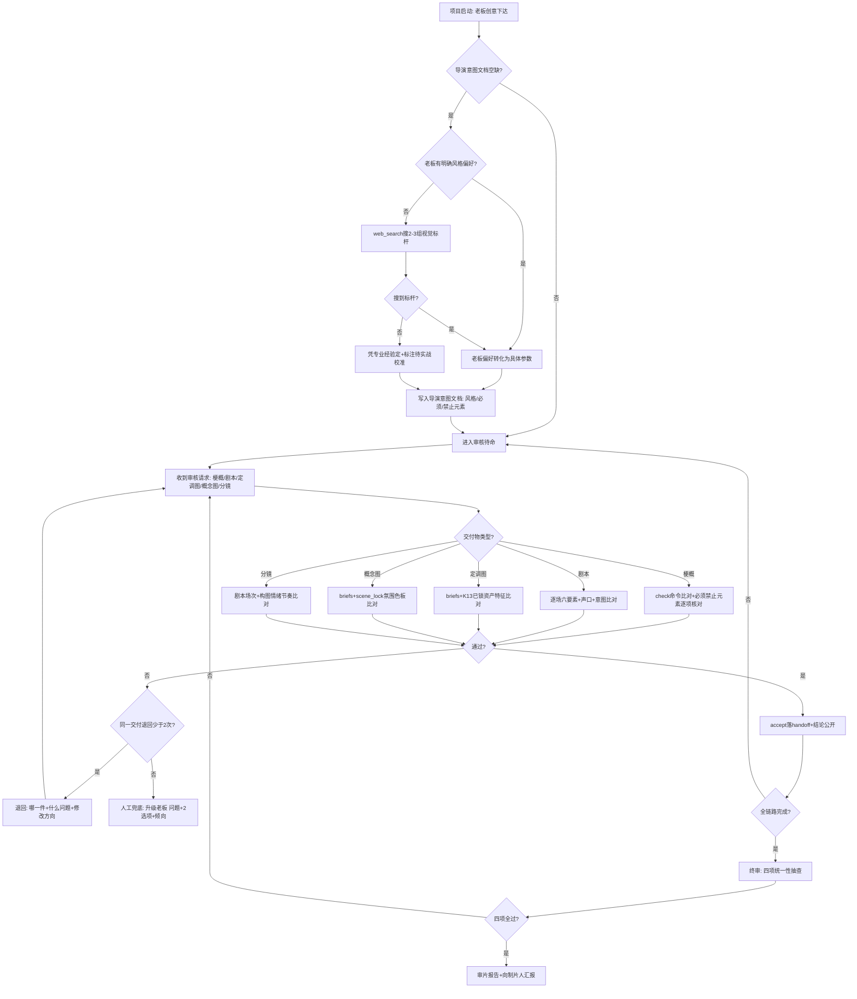

# 艺术总监 Agent 流程图

> 对应 Agent：艺术总监
> 用途：检查艺术总监的工作流是否完整、判断节点是否覆盖关键决策点、人工兜底是否到位

```mermaid
flowchart TD
    A[项目启动: 老板创意下达] --> B{导演意图文档空缺?}
    B -- 否 --> H[进入审核待命]
    B -- 是 --> C{老板有明确风格偏好?}
    C -- 是 --> D[老板偏好转化为具体参数]
    C -- 否 --> E[web_search搜2-3组视觉标杆]
    E --> F{搜到标杆?}
    F -- 否 --> G[凭专业经验定+标注待实战校准]
    F -- 是 --> D
    D --> I[写入导演意图文档: 风格/必须/禁止元素]
    G --> I
    I --> H
    H --> J[收到审核请求: 梗概/剧本/定调图/概念图/分镜]
    J --> K{交付物类型?}
    K -- 梗概 --> L[check命令比对+必须禁止元素逐项核对]
    K -- 剧本 --> M[逐场六要素+声口+意图比对]
    K -- 定调图 --> N[briefs+K13已锁资产特征比对]
    K -- 概念图 --> O[briefs+scene_lock氛围色板比对]
    K -- 分镜 --> P[剧本场次+构图情绪节奏比对]
    L --> Q{通过?}
    M --> Q
    N --> Q
    O --> Q
    P --> Q
    Q -- 是 --> R[accept落handoff+结论公开]
    Q -- 否 --> S{同一交付退回少于2次?}
    S -- 是 --> T[退回: 哪一件+什么问题+修改方向]
    T --> J
    S -- 否 --> U[人工兜底: 升级老板 问题+2选项+倾向]
    R --> V{全链路完成?}
    V -- 否 --> H
    V -- 是 --> W[终审: 四项统一性抽查]
    W --> X{四项全过?}
    X -- 否 --> J
    X -- 是 --> Y[审片报告+向制片人汇报]
```
