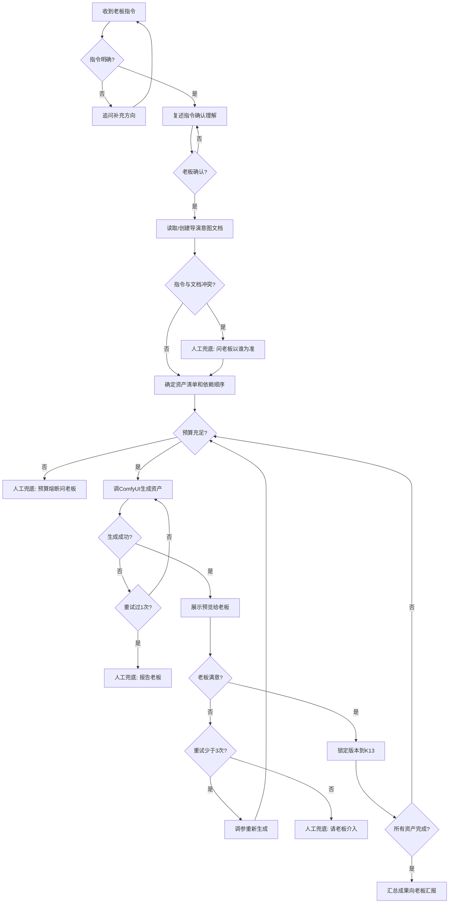

# 制片人 Agent 流程图

> 对应 Agent：制片人（MVP阶段）
> 用途：检查制片人的工作流是否完整、判断节点是否覆盖关键决策点、人工兜底是否到位

```mermaid
flowchart TD
    A[收到老板指令] --> B{指令明确?}
    B -- 否 --> C[追问补充方向]
    C --> A
    B -- 是 --> D[复述指令确认理解]
    D --> E{老板确认?}
    E -- 否 --> D
    E -- 是 --> F[读取/创建导演意图文档]
    F --> G{指令与文档冲突?}
    G -- 是 --> H[人工兜底: 问老板以谁为准]
    G -- 否 --> I[确定资产清单和依赖顺序]
    H --> I
    I --> J{预算充足?}
    J -- 否 --> K[人工兜底: 预算熔断问老板]
    J -- 是 --> L[调ComfyUI生成资产]
    L --> M{生成成功?}
    M -- 否 --> N{重试过1次?}
    N -- 否 --> L
    N -- 是 --> O[人工兜底: 报告老板]
    M -- 是 --> P[展示预览给老板]
    P --> Q{老板满意?}
    Q -- 否 --> R{重试少于3次?}
    R -- 是 --> S[调参重新生成]
    S --> J
    R -- 否 --> T[人工兜底: 请老板介入]
    Q -- 是 --> U[锁定版本到K13]
    U --> V{所有资产完成?}
    V -- 否 --> J
    V -- 是 --> W[汇总成果向老板汇报]
```
