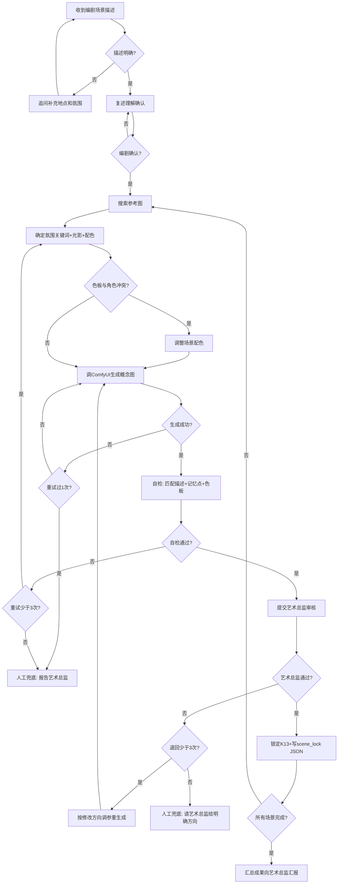

# 场景设计师 Agent 流程图

> 对应 Agent：场景设计师
> 用途：检查场景设计师的工作流是否完整、判断节点是否覆盖关键决策点、人工兜底是否到位

```mermaid
flowchart TD
    A[收到编剧场景描述] --> B{描述明确?}
    B -- 否 --> C[追问补充地点和氛围]
    C --> A
    B -- 是 --> D[复述理解确认]
    D --> E{编剧确认?}
    E -- 否 --> D
    E -- 是 --> F[搜索参考图]
    F --> G[确定氛围关键词+光影+配色]
    G --> H{色板与角色冲突?}
    H -- 是 --> I[调整场景配色]
    I --> J
    H -- 否 --> J[调ComfyUI生成概念图]
    J --> K{生成成功?}
    K -- 否 --> L{重试过1次?}
    L -- 否 --> J
    L -- 是 --> M[人工兜底: 报告艺术总监]
    K -- 是 --> N[自检: 匹配描述+记忆点+色板]
    N --> O{自检通过?}
    O -- 否 --> P{重试少于3次?}
    P -- 是 --> G
    P -- 否 --> M
    O -- 是 --> Q[提交艺术总监审核]
    Q --> R{艺术总监通过?}
    R -- 否 --> S{退回少于3次?}
    S -- 是 --> T[按修改方向调参重生成]
    T --> J
    S -- 否 --> U[人工兜底: 请艺术总监给明确方向]
    R -- 是 --> V[锁定K13+写scene_lock JSON]
    V --> W{所有场景完成?}
    W -- 否 --> F
    W -- 是 --> X[汇总成果向艺术总监汇报]
```
