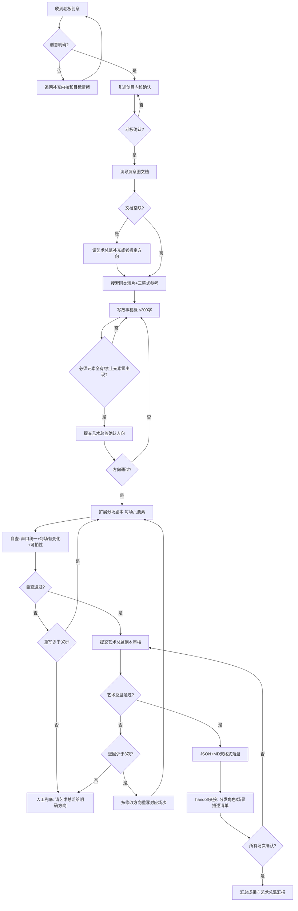

# 编剧 Agent 流程图

> 对应 Agent：编剧
> 用途：检查编剧的工作流是否完整、判断节点是否覆盖关键决策点、人工兜底是否到位

```mermaid
flowchart TD
    A[收到老板创意] --> B{创意明确?}
    B -- 否 --> C[追问补充内核和目标情绪]
    C --> A
    B -- 是 --> D[复述创意内核确认]
    D --> E{老板确认?}
    E -- 否 --> D
    E -- 是 --> F[读导演意图文档]
    F --> G{文档空缺?}
    G -- 是 --> H[请艺术总监补充或老板定方向]
    H --> I
    G -- 否 --> I[搜索同类短片+三幕式参考]
    I --> J[写故事梗概 ≤200字]
    J --> K{必须元素全有/禁止元素零出现?}
    K -- 否 --> J
    K -- 是 --> L[提交艺术总监确认方向]
    L --> M{方向通过?}
    M -- 否 --> J
    M -- 是 --> N[扩展分场剧本 每场六要素]
    N --> O[自查: 声口统一+每场有变化+可拍性]
    O --> P{自查通过?}
    P -- 否 --> Q{重写少于3次?}
    Q -- 是 --> N
    Q -- 否 --> R[人工兜底: 请艺术总监给明确方向]
    P -- 是 --> S[提交艺术总监剧本审核]
    S --> T{艺术总监通过?}
    T -- 否 --> U{退回少于3次?}
    U -- 是 --> V[按修改方向重写对应场次]
    V --> N
    U -- 否 --> R
    T -- 是 --> W[JSON+MD双格式落盘]
    W --> X[handoff交接: 分发角色/场景描述清单]
    X --> Y{所有场次确认?}
    Y -- 否 --> S
    Y -- 是 --> Z[汇总成果向艺术总监汇报]
```
