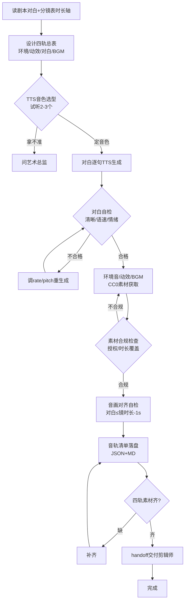

# 音效工程师 流程图（Mermaid）

> 版本 v1.0 | 2026-09-25

```mermaid
flowchart TD
    A[读剧本对白+分镜表时长轴] --> B[设计四轨总表<br/>环境/动效/对白/BGM]
    B --> C{TTS音色选型<br/>试听2-3个}
    C -- 拿不准 --> C1[问艺术总监]
    C -- 定音色 --> D[对白逐句TTS生成]
    D --> E{对白自检<br/>清晰/语速/情绪}
    E -- 不合格 --> E1[调rate/pitch重生成]
    E1 --> E
    E -- 合格 --> F[环境音/动效/BGM<br/>CC0素材获取]
    F --> G{素材合规检查<br/>授权/时长覆盖}
    G -- 不合规 --> F
    G -- 合规 --> H[音画对齐自检<br/>对白≤镜时长-1s]
    H --> I[音轨清单落盘<br/>JSON+MD]
    I --> J{四轨素材齐?}
    J -- 缺 --> K[补齐]
    K --> I
    J -- 齐 --> L[handoff交付剪辑师]
    L --> M[完成]
```

## 关键节点说明

| 节点 | 规则 |
|------|------|
| 音色门 | 全片统一1个音色，中途禁换 |
| 对白门 | 时长≤镜时长-1s（呼吸感），情绪与剧本标注一致 |
| 合规门 | 仅CC0/免费授权，商业素材一律不用 |
| 交付门 | 四轨素材+清单齐备才交付 |
